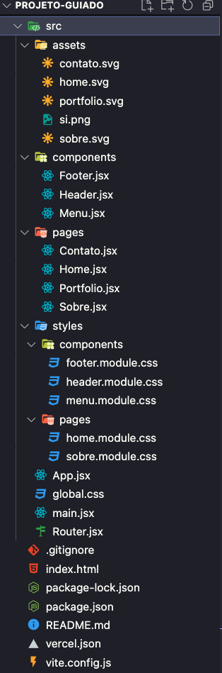

# Projeto-Guiado-React-Reprograma-s15 <h1 align="center">
  

# Turma: On23-TodasEmTech-Santander-ReactJS-III

15ª semana da turma online: Todas em Tech 0n23 - Front-end, iniciada dia 01/07/2023, onde vimos os seguintes conteúdos:

  - [1. Router](#1-rotas---react-router)
  - [2. CSS no React](#2-como-usar-css-em-react)
  - `Projeto Guiado`

## Conhecendo o projeto

## 🧠 Contexto

O objetivo era criar um site usando ReactJS, onde me apresento e enriqueço o meu portfólio, além de treinar todos os conteúdos vistos no módulo de ReactJS.

## O site pessoal contem 4 páginas:

* Home
* Sobre
* Portfolio
* Contato

Todas as páginas possuem os componentes:

* Menu
* Header
* Footer

## Estrutura do projeto

 

## `Tecnologias usadas`

| Ferramenta | Descrição |
| --- | --- |
| `ReactJS` | framework web|
| `Vite` | gerador de projeto de front-end|
| `npm` | gerenciador de pacotes|
| `Firebase` | Ferramenta realtime database para gravar as mensagens de contato|
| `Module CSS` | Ferramenta para ter mais produtividade ao estilizar a aplicação|
| `Phosphor` | Dependência com icones super legais|
| `React router dom` | Dependência para criar rotas no reactjs|
| `Axios` | Dependência para consumir api|
| `Vercel` | Hospedagem para a aplicação, fiz o deploy integrado com o github|
| `Github` | Hospedagem do código fonte integrado com gerenciador de versionamento|

>Passo a passo:

1) Criar o projeto com Vite
2) Apagar arquivos padrão
3) Faz o "Olá, Projeto Guiado!"
4) Instala react-router-dom
5) Cria o router v1 com html no element, importa no App e testa no navegador
6) Cria o menu (ainda sem estilo) e usa no Router
7) Cria as 4 páginas apenas com o h1 (ainda sem estilo)
8) Importa as páginas no Router e testa no navegador
9) Vamos começar a estilizar: incluir fonte, criar o css global e criar o css do menu
10) Criar o componente Header estilizado e com props
11) Criar o componente Footer estilizado e usar no Router
12) Incluir conteúdo na página Contato estilizada
13) Criar e integrar firebase com variaveis de ambiente na página Contato
14) Fazer a página Home estilizada
15) Incluir config da vercel 
16) Subir no github e fazer deploy (importante criar as variaveis de prod na vercel)
17) Fazer a página Sobre estilizada
18) Fazer a página Portfólio estilizada (com dados internos e consumindo api no github)
19) Criar README.md do projeto
20) Subir no github e garantir que o deploy ocorreu bem
21) Customizar o projeto e mudar imagens
22) Incluir links do github e do projeto no ar no Classroom

>Status:
CONCLUIDO

Confira o resultado final: https://meu-portfolio-seven-ashy.vercel.app/

